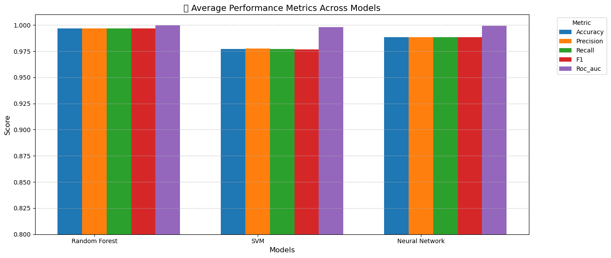
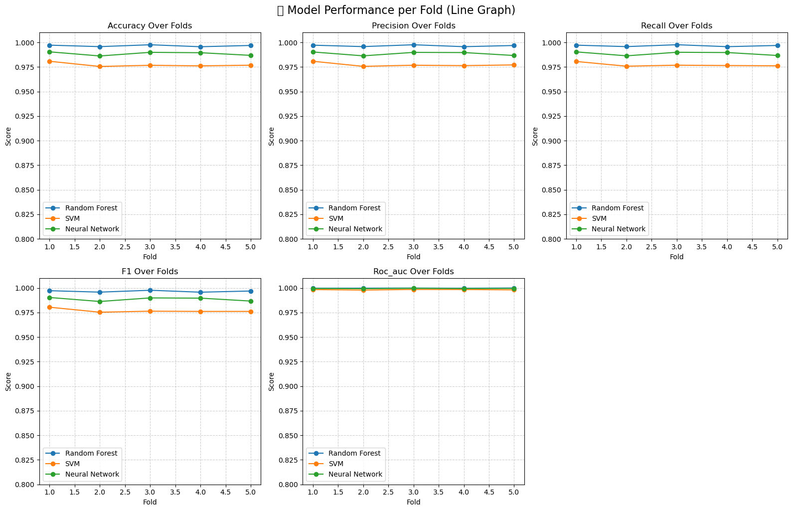
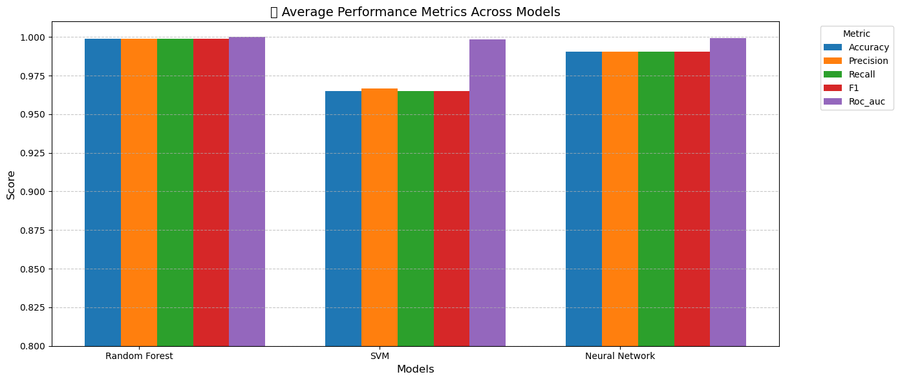
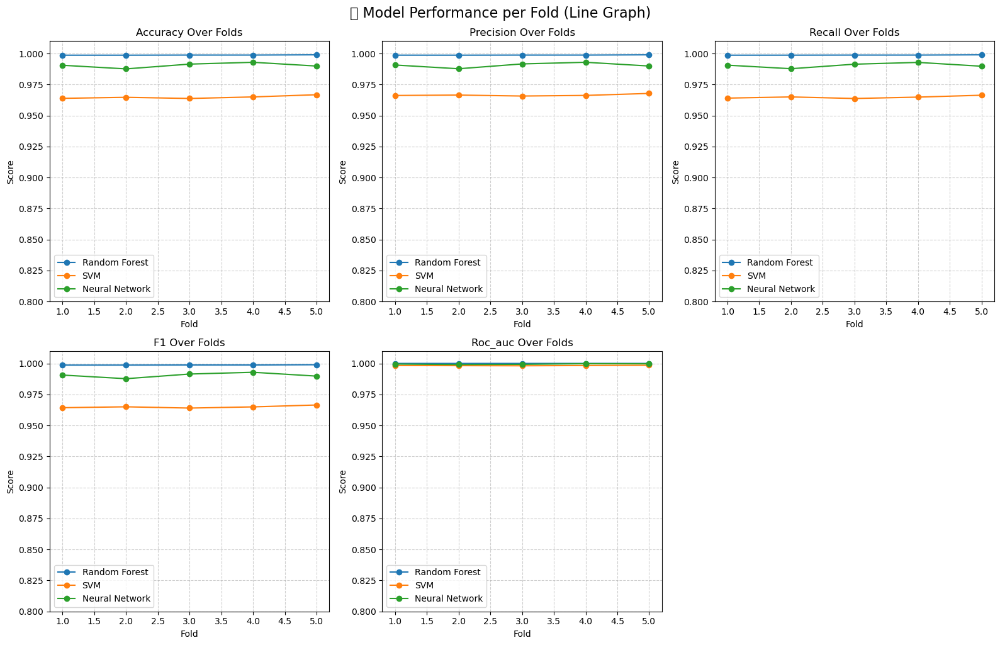

# Comparative Machine Learning Evaluation for Network Intrusion Detection

**CICIDS2017 · NSL-KDD · UNSW-NB15**

**Independent Machine Learning Study**

## Overview

This project presents a comparative evaluation of three classical machine
learning classifiers — Random Forest, Support Vector Machine (SVM), and a
Multi-Layer Perceptron (MLP) — for network intrusion detection, applied
independently to three widely used benchmark datasets: **CICIDS2017**,
**NSL-KDD**, and **UNSW-NB15**. Each dataset is preprocessed (cleaning, class
balancing via SMOTE, feature scaling), split into train/test partitions, and
used to train and evaluate all three classifiers under a consistent
evaluation protocol (accuracy, precision, recall, F1, ROC-AUC, and 5-fold
cross-validation with paired t-tests). The purpose is to examine how the
relative performance of these classifiers varies across different network
intrusion detection benchmark datasets — a comparative evaluation across
three benchmark datasets, not a cross-dataset transfer learning experiment.

## Research Question

> How does the performance of Random Forest, Support Vector Machine and
> Multi-Layer Perceptron classifiers vary across different network intrusion
> detection benchmark datasets?

Does the relative performance of these classifiers remain consistent across
the evaluated datasets?

## Repository Structure

```
network-intrusion-detection/
├── README.md
├── LICENSE
├── requirements.txt
├── .gitignore
├── notebooks/
│   └── network_intrusion_detection_analysis.ipynb
├── data/
│   └── README.md
├── results/
│   └── results_summary.csv
└── figures/
    ├── cicids2017_metric_comparison.png
    ├── cicids2017_metrics_per_fold.png
    ├── nslkdd_metric_comparison.png
    └── nslkdd_metrics_per_fold.png
```

## Dataset Summary

| Dataset | Task | Source Rows | Analysed/Sampled Data | Classes |
|---|---|---:|---:|---:|
| CICIDS2017 | Multiclass | 2,830,743 | 46,930 (before SMOTE) | 10 |
| NSL-KDD | Multiclass | 125,973 | 36,703 | 5 |
| UNSW-NB15 | Binary | 175,341 | 30,000 (sampled) | 2 |

See [`data/README.md`](data/README.md) for dataset sources and instructions
to reproduce locally (raw data is not distributed in this repository).

## Methodology

The three pipelines were developed iteratively during an exploratory study
and are **not methodologically identical**:

- **CICIDS2017:** eight capture-day CSVs merged, constant-value columns
  dropped, classes with >1,950 samples retained and capped at 5,000 each,
  label-encoded, infinite values removed, `StandardScaler` applied, SMOTE
  applied to balance all classes, then an 80/20 train/test split.
- **NSL-KDD:** `KDDTrain+.txt` loaded with the standard 41-feature schema,
  the `difficulty` column dropped, the ~40 raw attack labels mapped to 5
  categories (Dos, Probe, R2L, U2R, normal), majority classes downsampled,
  categorical features one-hot encoded, `StandardScaler` applied, then a
  stratified 80/20 split with SMOTE applied **only to the training partition**.
- **UNSW-NB15:** the parquet training set loaded, duplicate rows removed,
  the `attack_cat` column dropped (binary task only), classes downsampled to
  15,000 each, categorical features one-hot encoded, `StandardScaler`
  applied, then an 80/20 split.

**Note:** because preprocessing evolved during the exploratory study, the
three dataset pipelines are not methodologically identical. In particular,
the CICIDS2017 pipeline applied scaling and SMOTE before the final
train/test split. Results should therefore be interpreted as **within-dataset
experimental comparisons**, not as directly comparable, benchmark-equivalent
scores across datasets.

All three pipelines use the same model configurations and the same
evaluation function: `RandomForestClassifier(n_estimators=100)`,
`SVC(kernel='rbf', probability=True)`, and
`MLPClassifier(hidden_layer_sizes=(128, 64), activation='relu', solver='adam')`.

## Results

### CICIDS2017 (held-out test set)

| Model | Accuracy | Precision | Recall | F1 | ROC-AUC |
|---|---:|---:|---:|---:|---:|
| Random Forest | 0.9974 | 0.9974 | 0.9974 | 0.9974 | 0.9996 |
| SVM | 0.9808 | 0.9808 | 0.9806 | 0.9804 | 0.9983 |

*MLP is omitted here: the saved notebook output for this run does not match
the MLP configuration currently in the code (see [Limitations](#limitations)),
so its holdout metrics for this dataset cannot be verified.*

### NSL-KDD (held-out test set)

| Model | Accuracy | Precision | Recall | F1 | ROC-AUC |
|---|---:|---:|---:|---:|---:|
| Random Forest | 0.9986 | 0.9964 | 0.9774 | 0.9864 | 0.9999 |
| SVM | 0.9668 | 0.7608 | 0.8873 | 0.8028 | 0.9981 |
| MLP | 0.9887 | 0.8306 | 0.9667 | 0.8710 | 0.9883 |

### UNSW-NB15 (held-out test set)

| Model | Accuracy | Precision | Recall | F1 | ROC-AUC |
|---|---:|---:|---:|---:|---:|
| Random Forest | 0.9120 | 0.8801 | 0.9510 | 0.9142 | 0.9733 |
| SVM | 0.8962 | 0.8350 | 0.9838 | 0.9033 | 0.9159 |
| MLP | 0.8985 | 0.8403 | 0.9804 | 0.9049 | 0.9614 |

Full table also available at [`results/results_summary.csv`](results/results_summary.csv).

## Cross-Validation (5-fold)

Mean ± standard deviation across 5 folds, as saved in the notebook.

**CICIDS2017**

| Model | Accuracy | F1 | ROC-AUC |
|---|---:|---:|---:|
| Random Forest | 0.9966 ± 0.0008 | 0.9966 ± 0.0008 | 0.9998 ± 0.0001 |
| SVM | 0.9772 ± 0.0019 | 0.9768 ± 0.0018 | 0.9982 ± 0.0002 |

*MLP cross-validation numbers are saved in the notebook for this dataset but
are excluded here for the same reason as the holdout result above: the saved
output shows Keras-style epoch/progress logs, indicating it was produced by a
different neural-network implementation than the `MLPClassifier` code
currently in this section.*

**NSL-KDD**

| Model | Accuracy | F1 | ROC-AUC |
|---|---:|---:|---:|
| Random Forest | 0.9988 ± 0.0001 | 0.9987 ± 0.0001 | 1.0000 ± 0.0000 |
| SVM | 0.9648 ± 0.0011 | 0.9650 ± 0.0009 | 0.9983 ± 0.0001 |
| MLP | 0.9905 ± 0.0018 | 0.9905 ± 0.0017 | 0.9995 ± 0.0003 |

For both datasets, all pairwise differences between models (paired t-test
on fold scores) were statistically significant at p < 0.05.

**UNSW-NB15:** the notebook contains the 5-fold cross-validation
implementation for this dataset, but no saved CV output is available in the
executed notebook; therefore only the held-out result above is reported for
UNSW-NB15.

## Figures






No cross-validation figures are included for UNSW-NB15, consistent with the
missing saved CV output noted above.

## Findings

- Random Forest achieved the strongest observed performance on CICIDS2017
  and NSL-KDD under their respective experimental setups.
- Performance was lower and more closely grouped across all three models on
  the UNSW-NB15 binary task.
- The variation observed across datasets illustrates why performance on a
  single network intrusion detection benchmark should not automatically be
  assumed to transfer to other data environments.

## Limitations

- The three datasets differ in collection environment, feature
  representation, class taxonomy, and classification task (multiclass vs.
  binary), so results are not directly comparable across datasets.
- Models were trained and evaluated independently within each dataset; this
  is a comparative evaluation, not train-on-one/test-on-another external
  validation or true cross-dataset generalisation.
- The CICIDS2017 exploratory pipeline applied feature scaling and SMOTE
  before the final train/test partition, so its reported performance should
  be interpreted cautiously relative to the NSL-KDD pipeline, which applies
  SMOTE only after the split.
- The saved output for the CICIDS2017 neural-network evaluation (cells
  producing epoch-by-epoch training logs) does not match the
  `MLPClassifier`-based code currently in that section of the notebook,
  indicating it is a stale output from an earlier implementation. For this
  reason, MLP holdout results for CICIDS2017 are excluded from this README.
- UNSW-NB15 cross-validation code exists in the notebook but has no saved
  execution output; only its holdout evaluation is reported here.
- This is an independent, self-directed study and has not been peer-reviewed
  or published.

## Requirements

See [`requirements.txt`](requirements.txt). Install with:

```bash
pip install -r requirements.txt
```

## Author

**Waleed Maqsood**
Master of Data Science, University of Southern Queensland (UniSQ), Australia

- GitHub: [github.com/waleedmaqsood20](https://github.com/waleedmaqsood20)
- LinkedIn: [linkedin.com/in/waleed-maqsood1](https://linkedin.com/in/waleed-maqsood1)

## License

Released under the [MIT License](LICENSE).
